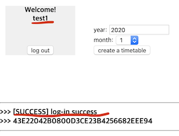
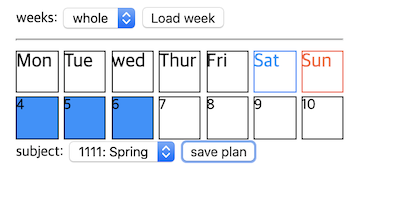

# bp-timetable
간단한 수업시간표를 만들고 저장할 수 있습니다.

월별 수업 일정을 과목별로 다양한 색상을 지정하여 한눈에 알기 쉽도록 출력합니다.

직접 사용해보기 -> [http://49.50.173.224:8080/bp-timetable/](http://49.50.173.224:8080/bp-timetable/)

## 1. 사용법

### step 1. 아이디 생성 혹은 로그인 하기

+ 원하는 아이디와 비밀번호를 입력 후 'check for sign-up'에 체크하고 'sign up' 버튼을 클릭하면 아이디가 생성됩니다.

+ 생성한 아이디와 비밀번호를 입력 후 'log in' 버튼을 클릭하면 정상 로그인 완료 메시지가 출력되며 로그인이 완료됩니다.

### step 2. 달력 생성

+ 시간표 작성을 원하시는 년도와 월을 입력 후 'create a timetable' 버튼을 클릭하세요.

+ 달력 생성이 완성됩니다. (만약 기존에 입력하신 일정이 있다면 자동으로 표시됩니다)
> step 2. 와 step 3. 은 서로 순서가 달라져도 상관없습니다.

### step 3. 과목 생성

+ 필요한 정보를 입력한 후 'add subject' 버튼을 클릭하여 과목을 추가합니다.
+ 바로 옆 섹션에서 추가된 과목을 확인할 수 있습니다. **(최대 10개 까지 저장할 수 있습니다)**
+ 각 필드에 대한 내용은 아래와 같습니다.
  - SID(subject identifier): 각 과목을 구별하기 위한 유일한 식별자입니다. 따라서 **서로 중복되지 않도록 유의해 주십시오.** 숫자만 가능하며 1~999999 사이의 값을 가질 수 있습니다. (필수사항)
  - Subject Name: 과목의 이름입니다. 별도로 지정하지 않을시 기본값은 dodgeblue입니다. 중복가능. (필수사항)
  - Color Tag: 시간표에서 과목들을 구별하기 쉽게 색상 태그를 지정할 수 있습니다. 중복가능. (선택사항)
  - Teacher: 담당 선생님(강의자) 입력할 수 있습니다. 중복가능. (선택사항)
  - Description: 해당 과목에 대한 추가적인 설명내용입니다. 중복가능. (선택사항)
  

+ 과목섹션에서 각 과목의 'delete' 버튼을 클릭하면 해당 과목을 삭제합니다.
+ **[주의] 과목 삭제시 기존에 저장하신 시간표내에서 해당 과목이 일괄적으로 전체 삭제됩니다.
> 특정 날짜의 과목만 하나씩 삭제하는 기능은 구현 전 이므로, 특정 날짜에만 과목을 비우고 싶다면 흰 바탕 색깔태그와 공백문자를 입력한 과목을 추가해주십시오.

### step 4. 일정 생성

+ 원하는 년도와 월의 달력이 만들어져 있는지 확인 하신 후, 원하는 주(week)를 선택 후 'Load week' 버튼을 클릭합니다.
+ 선택하신 주(week)에 해당되는 날짜가 월~일요일 순서로 표시됩니다.

+ 일정을 저장하기 원하는 날짜를 클릭한 다음(선택시 파란색으로 변합니다) 원하는 과목을 선택한 후 'save plan' 버튼을 클릭하여 저장합니다.

+ 지정한 날짜와 선택한 과목의 이름과 색상 태그가 달력에 표시됩니다.
+ 달력에 일정이 표시되면 DB에 정상 저장되었다는 의미이며, 나중에 같은 아이디로 다시 로그인하고 해당 년,월의 달력을 불러오면 일정을 다시 확인할 수 있습니다.

+ 일정 변경시, 기존 일정에 새로운 과목을 언제든지 추가 및 수정하여 저장할 수 있습니다.
